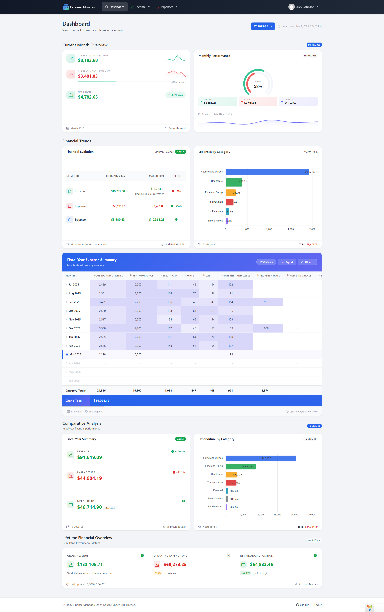
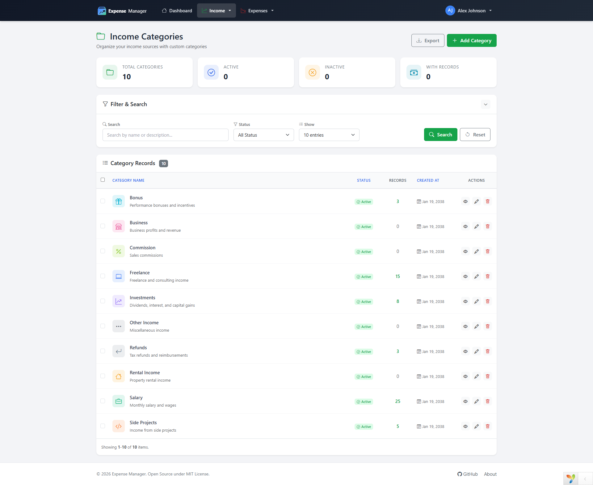
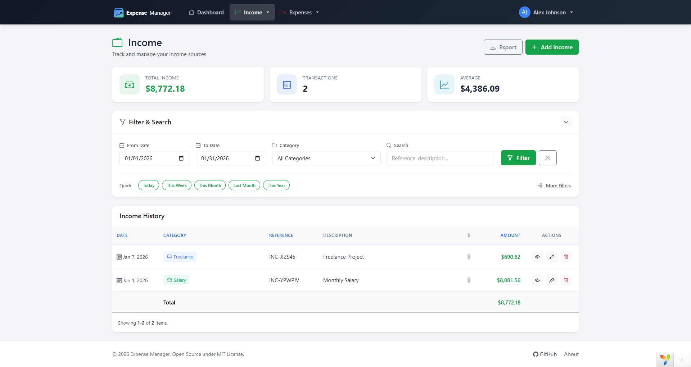
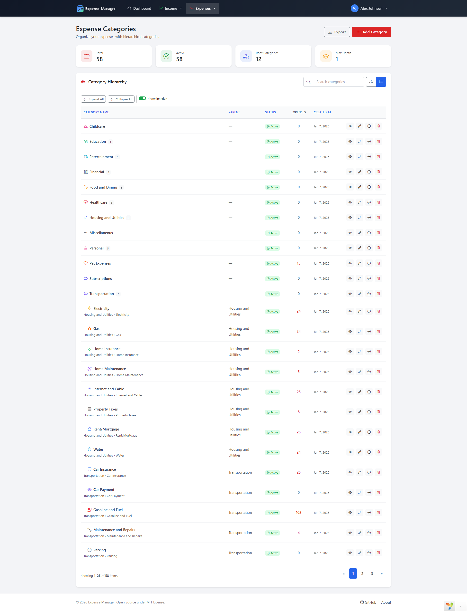
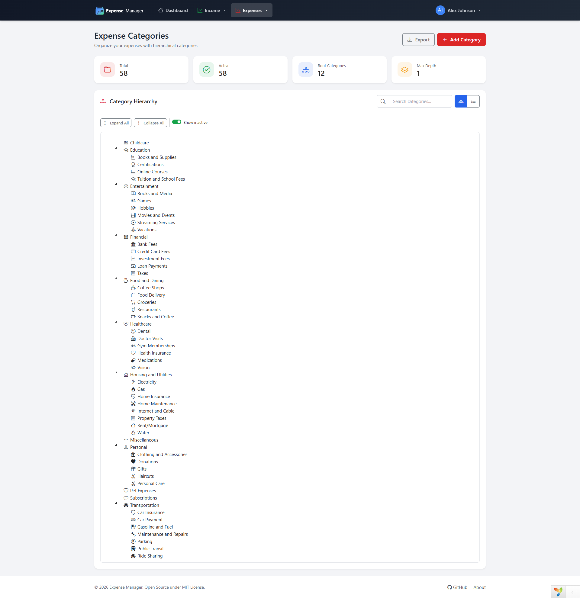
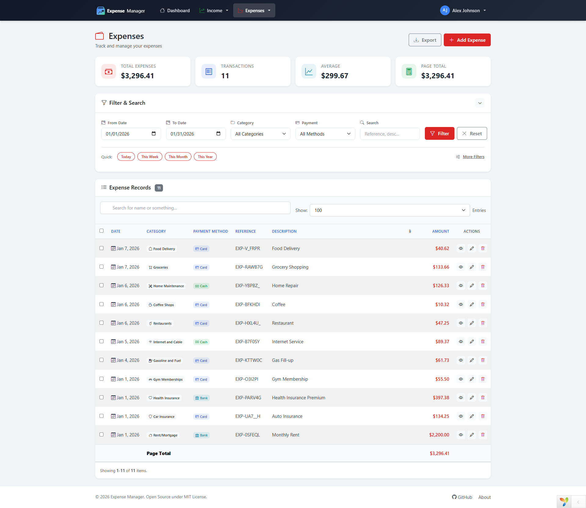
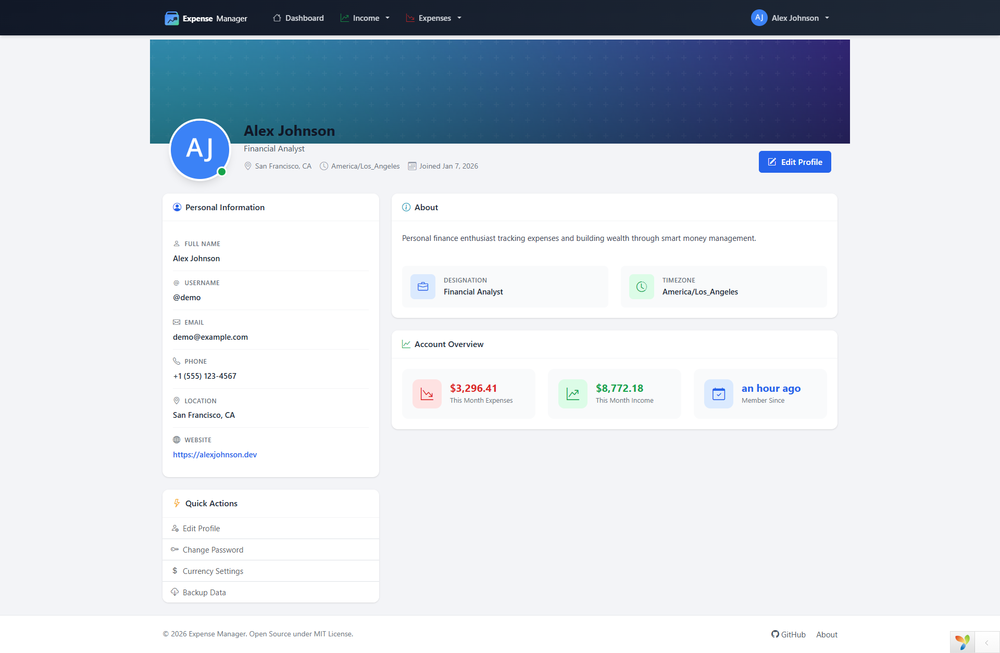

<p align="center">
  
</p>

<h1 align="center">Expense Manager</h1>

<p align="center">
  <strong>A production-ready, open-source financial management system built with PHP Yii2 — crafted for businesses, freelancers, and individuals who demand clarity over their money.</strong>
</p>

<p align="center">
  <a href="https://github.com/mohsin-rafique/expense-manager/releases">
    
  </a>
  <a href="https://github.com/mohsin-rafique/expense-manager/blob/master/LICENSE">
    
  </a>
  <a href="https://github.com/mohsin-rafique/expense-manager/stargazers">
    
  </a>
  <a href="https://github.com/mohsin-rafique/expense-manager/network/members">
    
  </a>
  <a href="https://github.com/mohsin-rafique/expense-manager/issues">
    
  </a>
  
  
  
  
  
</p>

<p align="center">
  <a href="#-overview">Overview</a> •
  <a href="#-why-expense-manager">Why Choose It</a> •
  <a href="#-features">Features</a> •
  <a href="#-screenshots">Screenshots</a> •
  <a href="#-tech-stack">Tech Stack</a> •
  <a href="#-installation">Installation</a> •
  <a href="#%EF%B8%8F-configuration">Configuration</a> •
  <a href="#-usage">Usage</a> •
  <a href="#-roadmap">Roadmap</a> •
  <a href="#-hire-the-developer">Hire Me</a> •
  <a href="#-contributing">Contributing</a> •
  <a href="#-license">License</a>
</p>

---

> **If this project saves you time or inspires your own work, please consider giving it a ⭐ star — it takes one second and means the world to an open-source developer.**

---

## 🧭 Overview

**Expense Manager** is a self-hosted, full-featured financial tracking application built from the ground up with the **Yii2 PHP framework**. It gives businesses, freelancers, and individuals a clean, powerful dashboard to manage income, expenses, categories, and reports — without depending on third-party cloud services or paying subscription fees.

This is not a demo project. It is a production-grade application with:

- Secure authentication, CSRF protection, and hardened session management
- A normalized relational database schema with versioned migrations
- Professionally formatted XLSX exports with column formatting and frozen headers
- A unified AJAX response system across all controllers
- Clean MVC architecture following Yii2 conventions throughout

Whether you are a business owner looking for a finance tool you control, a developer evaluating modern PHP architecture, or a hiring manager assessing real-world PHP skill — this project speaks for itself.

---

## 💡 Why Expense Manager?

Most expense-tracking tools either cost money, lock your data in someone else's cloud, or are too basic to be useful for a real business. Expense Manager was built to solve all three problems at once.

| What You Get | Why It Matters |
|---|---|
| **100% Free & Open Source** | No monthly fees, no vendor lock-in, full code ownership |
| **Self-Hosted** | Your financial data lives on your server, not ours |
| **Production-Ready Security** | Rate-limited login, bcrypt passwords, `.env`-based secrets, CSRF on every form |
| **Professional XLSX Exports** | Styled spreadsheets with branded headers — ready to share with accountants |
| **Hierarchical Categories** | Model real-world business expense trees, not flat lists |
| **50+ Currencies Supported** | Ready for international teams and multi-currency operations |
| **Modern, Responsive UI** | Bootstrap 5.3 with dark/light mode — looks great on desktop and mobile |
| **Built to Extend** | Clean Yii2 MVC architecture — easy to customize, easy to hand to a new developer |

---

## ✨ Features

### 💰 Income Management

- Record all income sources with date, amount, category, and reference
- Attach receipts and invoices (PDF, JPG, PNG) directly to each record
- Filter and search by date range, category, or reference keyword
- Export filtered results to professionally styled XLSX (Excel) files
- Inline quick-view popup with full record details

### 💸 Expense Management

- Track expenses with detailed metadata — date, amount, payment method, notes
- **Hierarchical categories** with parent/child structure for real-world expense trees
- Multiple payment methods: Cash, Card, Bank Transfer
- File attachment support for receipts and invoices
- Advanced filtering, searching, and pagination
- Export filtered data to styled XLSX — column-formatted, zebra-striped, and branded

### 📊 Dashboard & Reporting

- Financial overview dashboard with live summary cards
- Income vs. Expense balance tracking
- Monthly and yearly statistical breakdowns
- Category-wise spending analysis
- Interactive charts powered by ApexCharts
- Real-time balance widget

### 👤 User & Profile Management

- Secure registration and login with email verification
- Custom avatar and profile banner upload with server-side image resizing
- Password reset via email token
- "Remember me" persistent sessions
- Last login timestamp and IP tracking
- Hardened session cookies (configurable `SameSite` and `Secure` flags)

### ⚙️ Settings & Business Customization

- 50+ currencies with fully customizable symbol, position, and decimal formatting
- Date/time format and timezone preferences per user
- Company name, logo, and favicon upload for white-label feel
- Database backup/export from within the application
- All sensitive settings managed via `.env` — nothing hardcoded

### 🎨 UI/UX

- Responsive Bootstrap 5.3 layout — mobile, tablet, and desktop
- Dark and Light theme toggle (persisted per user)
- PJAX-powered navigation — fast, no full page reloads
- AJAX modals for all Create/Edit/View/Delete operations
- Toast notification system (NEM Toast) with success, warning, and error states
- Bootstrap Icons throughout — consistent, crisp iconography

### 🌐 Multi-Language Support (i18n)

- Full UI localization in **5 languages** — English, Spanish (Español), French (Français), Urdu (اردو), and German (Deutsch)
- In-app language switcher in the navigation bar — change languages with one click
- Per-user language preference saved to the database; remembered across sessions
- Automatic language detection for guests via the browser `Accept-Language` header, with cookie persistence
- **Right-to-left (RTL)** layout support, enabled automatically for Urdu
- Built on Yii2's native `Yii::t()` translation framework with PHP message catalogs — easy to extend with new languages
- Graceful fallback to English for any string not yet translated

### 🔐 Security (Production-Hardened)

- Login rate limiting — max 5 failed attempts per IP per 15 minutes
- CSRF protection on every POST form
- Bcrypt password hashing
- SQL injection prevention via PDO prepared statements
- XSS prevention via Yii2 output encoding
- Session cookie hardening via `.env` (`SESSION_SECURE`, `SESSION_SAMESITE`)
- Debug mode disabled by default — no stack traces in production

---

## 📸 Screenshots

<p align="center">
  
  <br><em>Dashboard — See your full financial picture at a glance: income, expenses, balance, and trends</em>
</p>

<p align="center">
  
  <br><em>Income Categories — Organize income sources with icons and colors for instant recognition</em>
</p>

<p align="center">
  
  <br><em>Income — Track every earning with date, category, amount, reference, and attachments</em>
</p>

<p align="center">
  
  <br><em>Expense Categories — Grid view with icon, color, and usage count per category</em>
</p>

<p align="center">
  
  <br><em>Expense Categories — Hierarchical tree view for modeling real-world business expense structures</em>
</p>

<p align="center">
  
  <br><em>Expenses — Complete expense ledger with filters, search, payment method, and export</em>
</p>

<p align="center">
  
  <br><em>Profile — User settings, avatar, theme preference, currency, and timezone</em>
</p>

---

## 🛠 Tech Stack

This project demonstrates a deliberate, professional choice of technologies — selected for stability, security, and real-world production viability.

| Layer | Technology | Why |
|---|---|---|
| **Backend Framework** | [Yii2](https://www.yiiframework.com/) v2.0.53 | Fast, secure, enterprise-proven PHP framework |
| **Language** | PHP 8.1+ | Modern type declarations, named arguments, enums |
| **Database** | MySQL 5.7+ / MariaDB 10.3+ | Proven relational storage with full migration history |
| **ORM** | Yii2 ActiveRecord | Clean model layer with relations, scopes, and validation |
| **Frontend** | Bootstrap 5.3 | Responsive, accessible, mobile-first UI framework |
| **Icons** | Bootstrap Icons | Consistent, high-quality SVG icon set |
| **Charts** | [ApexCharts](https://apexcharts.com/) | Interactive, animated financial charts |
| **XLSX Export** | [PhpSpreadsheet](https://phpspreadsheet.readthedocs.io/) | Styled Excel exports with formatting, freeze panes, borders |
| **AJAX Navigation** | Yii2 PJAX | Partial page rendering without full reloads |
| **Notifications** | NEM Toast | Non-blocking, accessible toast alerts |
| **Dependency Manager** | Composer 2.x | PSR-4 autoloading, package versioning |

---

## 📋 Requirements

| Requirement | Version |
|---|---|
| PHP | 8.1 or higher |
| MySQL / MariaDB | 5.7+ / 10.3+ |
| Composer | 2.x |
| Web Server | Apache / Nginx |

**Required PHP Extensions:** `pdo_mysql` · `mbstring` · `intl` · `gd` or `imagick` · `json` · `openssl`

---

## 🚀 Installation

### Option 1: Composer (Recommended)

```bash
composer create-project mohsin-rafique/expense-manager expense-manager
cd expense-manager
composer install
chmod -R 755 runtime web/assets web/uploads
```

### Option 2: Clone from GitHub

```bash
git clone https://github.com/mohsin-rafique/expense-manager.git
cd expense-manager
composer install
chmod -R 755 runtime web/assets web/uploads
```

### Option 3: Download ZIP

1. Download from [GitHub Releases](https://github.com/mohsin-rafique/expense-manager/releases)
2. Extract to your web server root
3. Run `composer install`
4. Set directory permissions on `runtime/`, `web/assets/`, `web/uploads/`

---

## ⚙️ Configuration

### 1. Database Setup

```sql
CREATE DATABASE expense_manager CHARACTER SET utf8mb4 COLLATE utf8mb4_unicode_ci;
```

### 2. Environment File

Copy the example and configure your environment:

```bash
cp .env.example .env
```

```env
# Application
YII_DEBUG=false
YII_ENV=prod

# Database
DB_DSN=mysql:host=localhost;dbname=expense_manager
DB_USERNAME=your_db_user
DB_PASSWORD=your_db_password
DB_CHARSET=utf8mb4

# Session Security (set SESSION_SECURE=true when running HTTPS)
SESSION_SECURE=false
SESSION_SAMESITE=Lax
```

> Your `.env` file is gitignored — credentials are never committed to the repository.

> ⚠️ Never set `YII_DEBUG=true` in production — it exposes stack traces and internal file paths.

### 3. Run Database Migrations

```bash
php yii migrate
```

This creates all required tables: `user`, `profile`, `settings`, `income_categories`, `incomes`, `expense_categories`, `expenses`.

### 4. Optional: Seed Demo Data

```bash
php yii seed/demo
```

Creates a demo account with realistic sample data so you can explore the app immediately.

| Field | Value |
|---|---|
| Email | demo@example.com |
| Password | demo123 |

> ⚠️ Remove or change the demo account before going live in production.

### 5. Cookie Validation Key

Update `config/web.php` with a unique secret key:

```php
'request' => [
    'cookieValidationKey' => 'your-unique-random-secret-here',
],
```

### 6. Web Server

**Apache** — The `web/.htaccess` file is included. Enable `mod_rewrite`:

```bash
sudo a2enmod rewrite
sudo systemctl restart apache2
```

**Nginx:**

```nginx
server {
    listen 80;
    server_name your-domain.com;
    root /path/to/expense-manager/web;
    index index.php;

    location / {
        try_files $uri $uri/ /index.php?$args;
    }

    location ~ \.php$ {
        include fastcgi_params;
        fastcgi_param SCRIPT_FILENAME $document_root$fastcgi_script_name;
        fastcgi_pass unix:/var/run/php/php8.1-fpm.sock;
    }

    location ~ /\.(ht|git) {
        deny all;
    }
}
```

---

## 📖 Usage

### Quick Start

1. Open `http://your-domain.com` or `http://localhost/expense-manager/web/`
2. Log in with the demo account or register a new user
3. Go to **Settings** — configure your currency, timezone, and branding
4. Create your income and expense **Categories**
5. Start recording transactions under **Income** and **Expenses**

### Managing Income

1. Navigate to **Income → All Income**
2. Click **Add Income**
3. Select date, category, amount, optional reference, and optional attachment
4. Use the filter bar to search and narrow records
5. Click **Export** to download a styled XLSX spreadsheet

### Managing Expenses

1. Navigate to **Expenses → All Expenses**
2. Click **Add Expense**
3. Select date, category, amount, payment method, optional reference and attachment
4. Filter and search across all fields
5. Export filtered results to XLSX

### Categories

**Income Categories:** Navigate to **Income → Categories** — add, edit, delete, set icon and color.

**Expense Categories:** Navigate to **Expenses → Categories** — supports parent/child hierarchy, drag-and-drop organization, icon and color customization.

### Dashboard

The dashboard provides a real-time snapshot: total income, total expenses, current balance, monthly breakdown, and category-level charts.

---

## 📁 Project Structure

```
expense-manager/
├── assets/                 # Asset bundles (CSS/JS registration)
├── commands/               # Console commands (migrations, seeders)
├── components/             # Reusable application components
│   ├── ApiResponse.php     # Unified AJAX response envelope
│   ├── BalanceHelper.php   # Income/expense balance calculation
│   ├── CurrencyFormatter.php
│   └── ...
├── config/                 # Application configuration
│   ├── web.php             # Main web application config
│   ├── db.php              # Database config (reads from .env)
│   └── params.php
├── controllers/            # HTTP request handlers (MVC Controllers)
│   ├── ExpenseController.php
│   ├── IncomeController.php
│   ├── ProfileController.php
│   └── ...
├── migrations/             # Versioned database schema migrations
├── models/                 # ActiveRecord models + Search models
│   ├── Expense.php
│   ├── ExpenseSearch.php
│   ├── Income.php
│   └── ...
├── views/                  # Twig-compatible PHP view templates
│   ├── expenses/
│   ├── incomes/
│   ├── layouts/
│   └── ...
├── widgets/                # Reusable UI widget components
├── web/                    # Public web root (Apache/Nginx points here)
│   ├── css/
│   ├── js/
│   ├── uploads/
│   └── index.php
├── .env.example            # Environment template
├── composer.json
├── LICENSE
└── README.md
```

---

## 🗺 Roadmap

The project is under active development. Planned features in priority order:

- [ ] **Budget management module** — set monthly/yearly budgets per category with alerts
- [ ] **Recurring transactions** — auto-generate periodic income/expense entries
- [ ] **Data import from CSV/Excel** — bulk import from spreadsheets
- [ ] **Advanced PDF reporting** — downloadable financial summaries
- [ ] **Multi-user / Team support** — shared workspaces with role-based access
- [ ] **REST API** — Yii2 RESTful API for mobile and third-party integrations
- [ ] **Mobile app** — React Native companion app via the REST API
- [ ] **Bank account integration** — connect to banking APIs for auto-import

Want to help build any of these? See [Contributing](#-contributing).

---

## 👨‍💻 Hire the Developer

<p align="center">
  <a href="https://github.com/mohsin-rafique">
    
  </a>
</p>

<p align="center">
  <strong>Mohsin Rafique</strong><br>
  Senior PHP Developer · Yii2 Specialist · Full Stack Engineer
</p>

<p align="center">
  <a href="https://github.com/mohsin-rafique">
    
  </a>
  &nbsp;
  <a href="https://mohsinrafique.com">
    
  </a>
  &nbsp;
  <a href="mailto:mohsin.rafique@gmail.com">
    
  </a>
</p>

---

### What I Build

This project is a live demonstration of what I bring to every client engagement:

- **Clean architecture** — MVC strictly followed, no logic in views, no fat controllers
- **Security-first mindset** — every form protected, every secret in `.env`, rate limiting baked in
- **Database professionalism** — normalized schemas, versioned migrations, no raw SQL in business logic
- **Real deliverables** — styled XLSX exports your accountant can open, not raw data dumps
- **Maintainable code** — PHPDoc on every class, PHP 8.1 type declarations throughout, Yii2 coding standards enforced

### Services Available

| Service | Description |
|---|---|
| **Custom PHP / Yii2 Development** | Bespoke web applications built on the Yii2 framework |
| **Financial & ERP Systems** | Expense tracking, invoicing, payroll, inventory management |
| **API Development** | RESTful APIs for mobile apps, third-party integrations |
| **Legacy PHP Modernization** | Upgrade and refactor old PHP 5/7 codebases to PHP 8+ |
| **Performance Optimization** | Query tuning, caching, response time improvements |
| **Security Audits** | Code review and hardening against OWASP Top 10 |

### Why Work With Me?

- 10+ years of PHP development experience
- Deep expertise in **Yii2**, Laravel, and raw PHP architecture
- Every project delivered with **full documentation and clean handover**
- Responsive communication — I treat your project like my own product
- Open source contributor — you can see how I write code *before* you hire me

> **Ready to discuss your project?** Email me at [mohsin.rafique@gmail.com](mailto:mohsin.rafique@gmail.com) or visit [mohsinrafique.com](https://mohsinrafique.com)

---

## 🤝 Contributing

Contributions from the community are welcome and genuinely appreciated. This project grows better with every issue reported, feature suggested, and pull request submitted.

### How to Contribute

1. **Fork** the repository on GitHub
2. **Clone** your fork: `git clone https://github.com/YOUR-USERNAME/expense-manager.git`
3. **Create** a feature branch: `git checkout -b feature/your-feature-name`
4. **Make** your changes following the code style guidelines below
5. **Commit** with a clear message: `git commit -m 'feat: add budget alert system'`
6. **Push** to your branch: `git push origin feature/your-feature-name`
7. **Open** a Pull Request against `master`

### Code Style

This project follows [Yii2 Coding Standards](https://github.com/yiisoft/yii2-coding-standards):

```bash
# Check code style
php vendor/bin/phpcs --standard=Yii2 controllers models components widgets

# Auto-fix code style
php vendor/bin/phpcbf --standard=Yii2 controllers models components widgets
```

### Reporting Bugs

Found a bug? Please [open an issue](https://github.com/mohsin-rafique/expense-manager/issues/new) and include:

- A clear description of the problem
- Steps to reproduce it
- Expected vs actual behavior
- PHP version, OS, and web server details
- Screenshots if applicable

---

## ❤️ Support This Project

If Expense Manager saved you time, inspired your work, or helped you learn — here is how you can give back:

<p align="center">
  <a href="https://github.com/mohsin-rafique/expense-manager/stargazers">
    
  </a>
  &nbsp;
  <a href="https://wise.com/pay/me/mohsinr301">
    
  </a>
</p>

- ⭐ **Star** this repository — it helps others discover the project and supports the developer's profile
- 🐛 **Report bugs** — help make the project more stable for everyone
- 💡 **Suggest features** — open a GitHub Discussion or Issue
- 📖 **Improve documentation** — fix typos, add examples, translate
- 📢 **Share** — tell other PHP developers, business owners, or communities about it

---

## 📄 Changelog

See [CHANGELOG.md](CHANGELOG.md) for the full version history, including every feature added, bug fixed, and security improvement applied since the initial release.

---

## 📜 License

This project is open-source software licensed under the **MIT License** — you are free to use, modify, and distribute it for any purpose, including commercial use.

```
MIT License

Copyright (c) 2025 Mohsin Rafique

Permission is hereby granted, free of charge, to any person obtaining a copy
of this software and associated documentation files (the "Software"), to deal
in the Software without restriction, including without limitation the rights
to use, copy, modify, merge, publish, distribute, sublicense, and/or sell
copies of the Software, and to permit persons to whom the Software is
furnished to do so, subject to the following conditions:

The above copyright notice and this permission notice shall be included in all
copies or substantial portions of the Software.
```

---

## 🙏 Acknowledgments

- [Yii Framework Team](https://www.yiiframework.com/) — the fast, secure, and professional PHP framework that powers this application
- [Bootstrap](https://getbootstrap.com/) — the world's most popular front-end toolkit
- [Bootstrap Icons](https://icons.getbootstrap.com/) — clean, high-quality open-source icons
- [ApexCharts](https://apexcharts.com/) — beautiful, interactive JavaScript charts
- [PhpSpreadsheet](https://phpspreadsheet.readthedocs.io/) — powerful PHP library for reading and writing spreadsheets
- All [contributors](https://github.com/mohsin-rafique/expense-manager/graphs/contributors) who improve this project with every pull request and issue

---

<p align="center">
  Built with precision and care by <a href="https://github.com/mohsin-rafique"><strong>Mohsin Rafique</strong></a>
</p>

<p align="center">
  <a href="https://github.com/mohsin-rafique/expense-manager/stargazers">⭐ Star this repository if it helped you — it keeps the project alive and growing.</a>
</p>

<p align="center">
  <a href="#expense-manager">↑ Back to Top</a>
</p>
